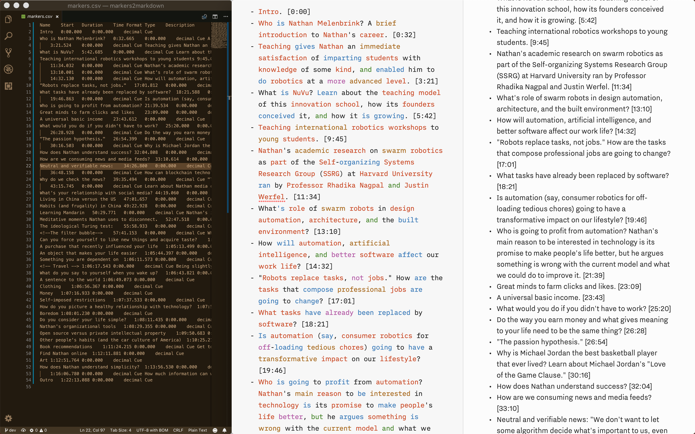

# markers2markdown
Parse Adobe Audition CSV wave markers to a Markdown list of episode notes.

### Create and export Adobe Audition Markers

- Add markers to your wave file or Multitrack session.
- In the `Markers` panel, select all your markers.
- Right click and choose `Export Selected Markers to CSV`.
- Save your CSV file to the `data/` folder and edit the `inputPath` of `index.js`.

If you `Name` and `Description` fields contain commas and double quotes, replace them in the CSV file to `(comma)` and `(opening-quotes)`, respectively, to avoid parsing errors.

### Clone this repository

	git clone https://github.com/nonoesp/markers2markdown
	cd markers2markdown

### Parse your markers to Markdown

	node index.js

### Instant parse

	bash loop.sh

### License

Released under the [MIT](https://github.com/nonoesp/markers2markdown/blob/master/LICENSE) license.

### Nono Martínez Alonso

I host [The Getting Simple Podcast](http://gettingsimple.com/podcast). You can find me at [Nono.ma](http://nono.ma/about) and [@nonoesp](http://twitter.com/nonoesp).
